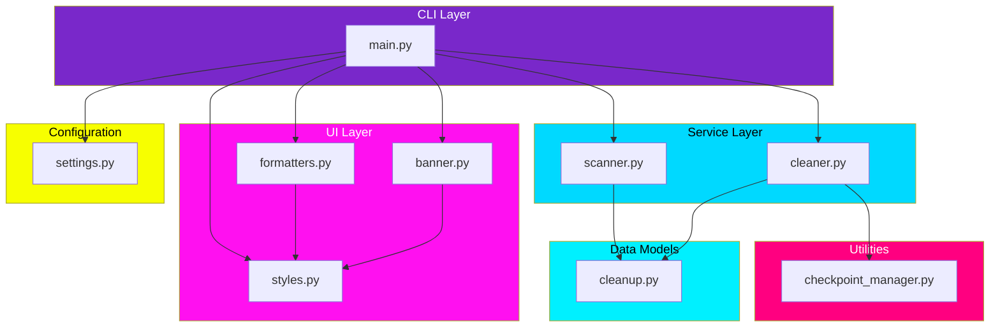
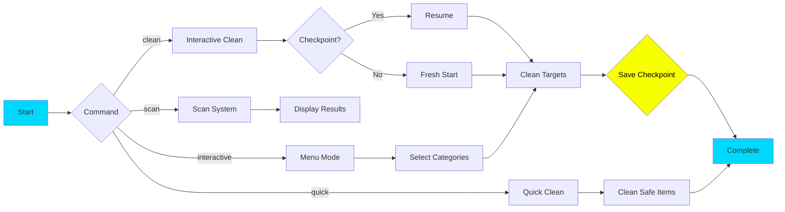

# MacPurge

```
    __  ___           ____                       
   /  |/  /___ ______/ __ \__  ___________  ___ 
  / /|_/ / __ `/ ___/ /_/ / / / / ___/ __ `/ _ \
 / /  / / /_/ / /__/ ____/ /_/ / /  / /_/ /  __/
/_/  /_/\__,_/\___/_/    \__,_/_/   \__, /\___/ 
                                   /____/       
```

**Reclaim Your Storage** - Synthwave-themed macOS cleanup utility with checkpoint/resume support.

## Features

- Intelligent scanning of macOS system for reclaimable space
- Category-based cleanup (caches, logs, Python venvs, node_modules, Docker, Xcode, etc.)
- Checkpoint/resume support for interrupted operations
- Interactive and non-interactive modes
- Dry-run mode for safe previewing
- Synthwave-themed terminal output

## Architecture



## Workflow



## Installation

```bash
# Clone or download the project
cd mac_cleaner

# Run installer
chmod +x installer.sh
./installer.sh

# Activate environment
source macpurge_venv/bin/activate
```

## Quick Start

```bash
# Scan your system
python src/main.py scan

# Quick cleanup (safe items only)
python src/main.py quick

# Interactive cleanup
python src/main.py clean

# Menu-driven mode
python src/main.py interactive

# Dry run (preview without deleting)
python src/main.py clean --dry-run
```

## Commands

### `scan`

Scan system for cleanable files and directories.

```bash
python src/main.py scan [OPTIONS]

Options:
  --all       Include items requiring confirmation
  --detailed  Show detailed list of all targets
  --limit N   Number of items to show (default: 20)
```

### `clean`

Interactive cleanup with selective deletion.

```bash
python src/main.py clean [OPTIONS]

Options:
  --dry-run         Preview without deleting
  --resume/--fresh  Resume from checkpoint or start fresh
  -y, --yes         Skip confirmation prompts
  -c, --category    Only clean specific categories
```

### `quick`

Quick cleanup of safe items only (caches, logs).

```bash
python src/main.py quick [OPTIONS]

Options:
  --dry-run  Preview without deleting
```

### `interactive`

Menu-driven cleanup with category selection.

```bash
python src/main.py interactive
```

### `status`

Show checkpoint status and resume info.

```bash
python src/main.py status
```

### `clear-checkpoint`

Clear any existing checkpoint data.

```bash
python src/main.py clear-checkpoint
```

## Categories

| Category | Description | Safe to Auto-Delete |
|----------|-------------|---------------------|
| `cache` | System and app caches | Yes |
| `logs` | System and app logs | Yes |
| `python_venv` | Python virtual environments | No (confirmation required) |
| `node_modules` | Node.js dependencies | No (confirmation required) |
| `brew` | Homebrew download cache | Yes |
| `docker` | Docker images/containers | No (confirmation required) |
| `xcode` | Xcode simulators/derived data | No (confirmation required) |
| `trash` | Trash folder | No (confirmation required) |
| `downloads` | Downloads folder | No (confirmation required) |

## Configuration

Copy `.env.example` to `.env` and customize:

```bash
# Scan settings
MACPURGE_MIN_SIZE_MB=10
MACPURGE_SCAN_DOWNLOADS=true
MACPURGE_SCAN_DOCKER=true

# Checkpoint settings  
MACPURGE_CHECKPOINT_INTERVAL=10
MACPURGE_STATE_DIR=state
```

## Checkpoint/Resume

MacPurge automatically saves progress during cleanup operations. If interrupted:

```bash
# Check status
python src/main.py status

# Resume from checkpoint
python src/main.py clean --resume

# Start fresh (ignore checkpoint)
python src/main.py clean --fresh

# Clear checkpoint manually
python src/main.py clear-checkpoint
```

## Project Structure

```
mac_cleaner/
├── src/
│   ├── main.py              # CLI entry point
│   ├── config/
│   │   └── settings.py      # Environment configuration
│   ├── models/
│   │   └── cleanup.py       # Data models
│   ├── services/
│   │   ├── scanner.py       # System scanner
│   │   └── cleaner.py       # Cleanup operations
│   ├── utils/
│   │   └── checkpoint_manager.py
│   └── ui/
│       ├── banner.py        # ASCII banner
│       ├── styles.py        # Synthwave theme
│       └── formatters.py    # Display formatters
├── docs/
│   ├── HELP.md
│   └── help/
├── state/                   # Checkpoint files (gitignored)
├── .env.example
├── .gitignore
├── installer.sh
├── requirements.txt
└── README.md
```

## License

MIT
